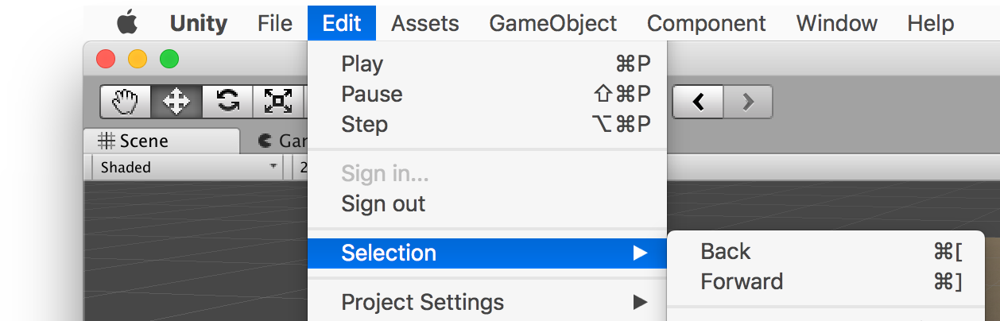

# UnityExtensions.SelectionHistory

Adds menu items to navigate back and forward in the Unity Editor, and handy back/forward buttons to the toolbar.



## Installation

Just clone this repo somewhere inside your Unity project's `Assets` folder.

```sh
$ cd Assets
$ git clone https://github.com/garettbass/UnityExtensions.SelectionHistory
```

## API

Your code can invoke these methods if you want to programmatically navigate backward or forward through the selection history:

```cs
UnityExtensions.SelectionHistory.CanNavigateBackward();
UnityExtensions.SelectionHistory.NavigateBackward();

UnityExtensions.SelectionHistory.CanNavigateForward();
UnityExtensions.SelectionHistory.NavigateForward();
```